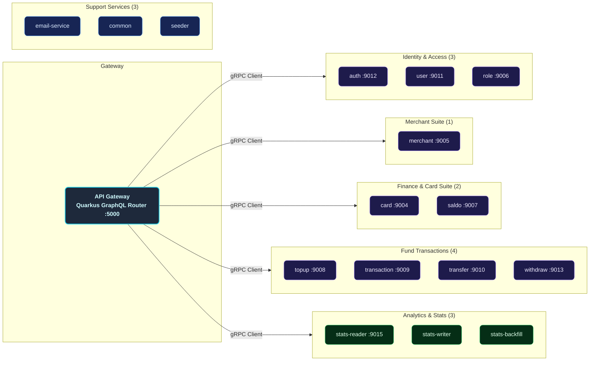
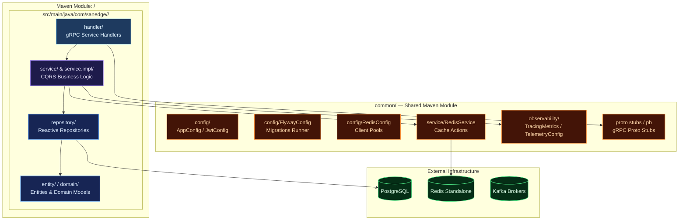
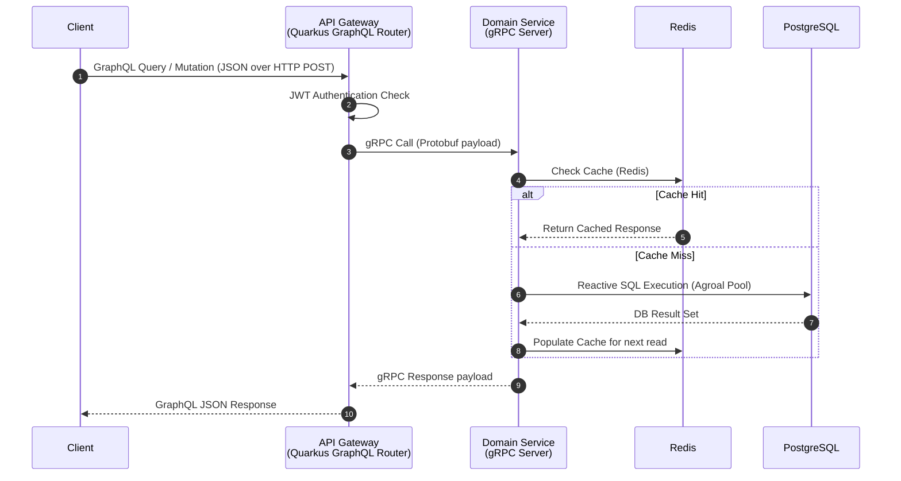
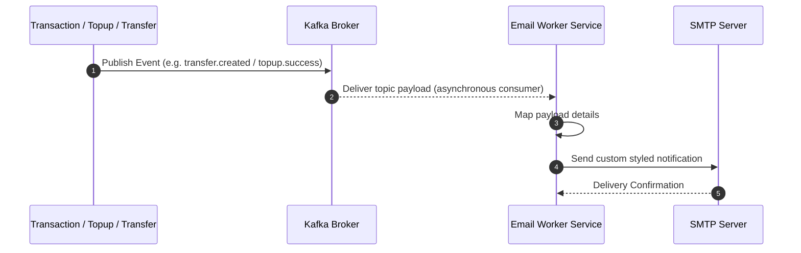
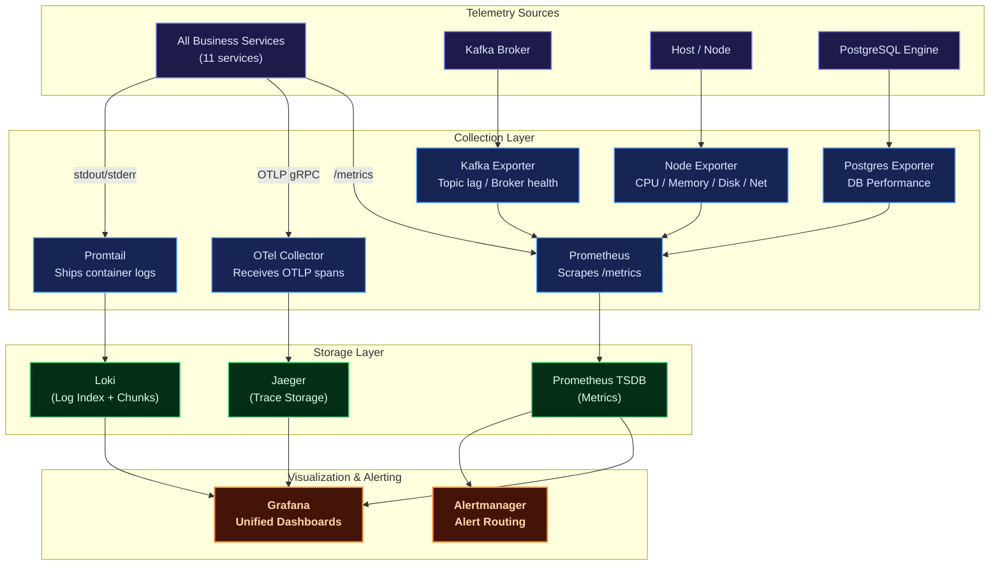
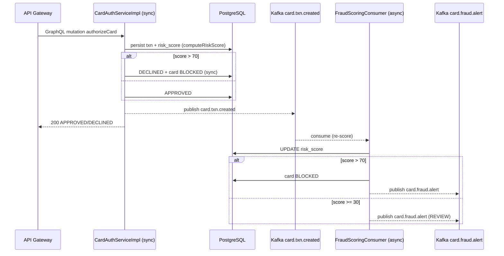
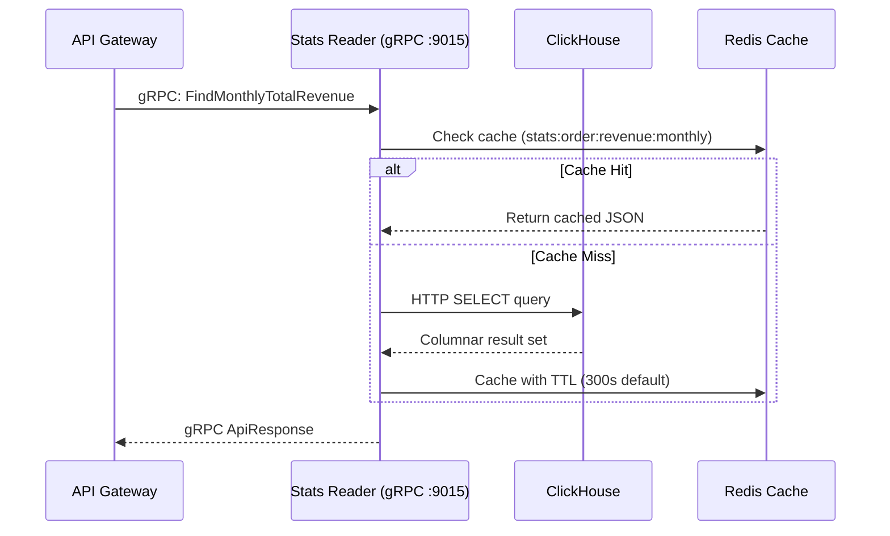
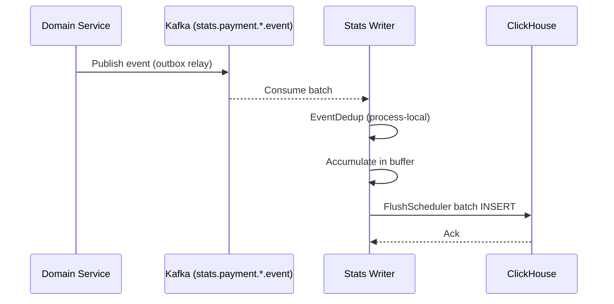
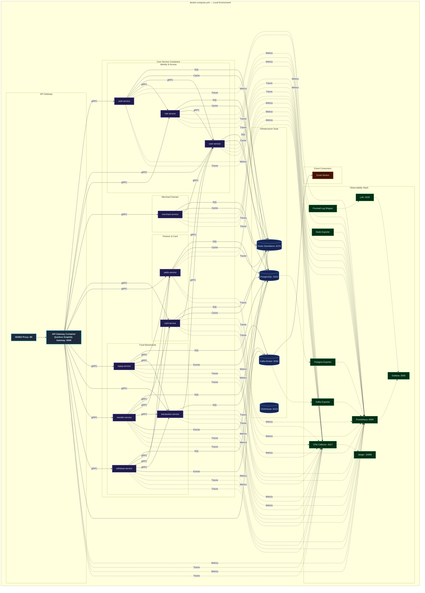

# Distributed Microservices — Payment Gateway Platform (Java Quarkus)

A production-grade, highly resilient, and fully observable **microservices payment gateway backend** built in **Java 21** using **Quarkus** reactive framework (v3.31.3). Designed around domain-driven service boundaries following Clean Architecture and CQRS principles, each service runs as an **independent JVM process** with its own gRPC server, database migrations, and caching layer — achieving true service-level isolation and independent deployability.

Each financial and identity business domain — Users, Roles, Cards, Merchants, Saldo, Topups, Transactions, Transfers, Withdrawals — lives in its own self-contained Maven module, running as a **standalone microservice**. These services communicate synchronously via high-performance **gRPC** protocols and asynchronously using **Apache Kafka** event propagation, exposing a unified reactive entry point through a **GraphQL API Gateway** powered by Quarkus SmallRye GraphQL.

The platform is fortified with a **comprehensive observability suite** (Prometheus, Grafana, Loki, Jaeger, OpenTelemetry), **distributed Redis caching** with custom telemetry for each service, and Kubernetes configurations ready for production auto-scaling.

---

## Key Features

| Domain | Capabilities |
| :--- | :--- |
| **Auth & Users** | Secure registration, multi-factor login, stateless JWT access/refresh token lifecycle, password reset workflows, OTP email verification, and `/me` profile GraphQL query. |
| **Roles & RBAC** | Custom permission configuration, granular access control matrices, and sub-second permission evaluation cached via Redis. |
| **Cards & VCC** | Virtual and debit card CRUD operations with soft-delete capabilities, card activation/suspension toggles, and multi-dimensional transaction analytics (daily/monthly/yearly topup, withdraw, transfer). |
| **Merchants** | Fully featured merchant onboarding, profile details management, business data registration, and merchant performance/transaction reports with full data restoration capabilities (soft delete & restore). |
| **Saldo (Balance)** | High-throughput, thread-safe real-time balance calculations, optimistic concurrency locks, and localized balances. |
| **Topup** | Balance loading ledger engine supporting multiple payment methods, detailed transactions logging, and soft-delete audit records. |
| **Transaction** | Centralized financial audit ledger collecting transaction events across the system, global search filters, status tracking, and monthly/yearly volume reports. |
| **Transfer** | Safe peer-to-peer card-to-card or user-to-user funds settlement with balance debit/credit synchronization and event-driven logging. |
| **Withdraw** | Funds settlement from user cards to external accounts/banks, daily transaction threshold limits, and status processing pipelines. |
| **Email Worker** | Kafka-driven asynchronous worker dispatching critical notification emails (OTPs, login alerts, merchant onboarding notices, and transfer/topup invoices) via SMTP. |
| **ClickHouse Analytics** | Columnar analytics database for high-performance statistical queries — order revenue, cashier sales, transaction amounts, category prices. Three-component pipeline: stats-writer (Kafka→ClickHouse), stats-reader (gRPC→Redis cache), stats-backfill (PostgreSQL→outbox→Kafka→ClickHouse). |
| **Fraud Scoring** | Dual-path fraud detection: synchronous scoring during card authorization + async re-scoring via Kafka consumer with card blocking and audit trail. |
| **Observability** | Multi-dimensional metrics (Prometheus + Grafana), log aggregation (Loki + Logback), end-to-end distributed tracing (Jaeger + OpenTelemetry), and resource monitors (Node, Kafka, Postgres Exporters). |
| **Deployment** | Local orchestration using Docker Compose with PostgreSQL, Redis, Kafka, and observability stack. Auto-scaling Kubernetes manifests with Horizontal Pod Autoscalers (HPA) and ArgoCD GitOps. |

---

## Architecture Overview

The platform implements a **Distributed Microservices** architecture. Each business service is a logical, decoupled, self-contained microservice inside its own Maven submodule, possessing its own independent gRPC boundary. A **Quarkus GraphQL API Gateway** acts as the unified edge router, exposing a single GraphQL schema (queries & mutations) and transforming client GraphQL operations into fast gRPC downstream communications via Quarkus gRPC clients.

### Core Architecture Principles

- **Service-Level Isolation**: Every microservice runs as an independent JVM process with its own gRPC server, database connection pool, caching layer, and Flyway migrations. No shared-memory coupling between services.
- **Clean Architecture & CQRS**: Separation of concerns using `Handler (gRPC) → Service (Command/Query) → Repository (Command/Query)` layers ensures business logic remains clean, performant, and framework-agnostic.
- **Reactive Execution**: Powered entirely by Quarkus reactive engine and Mutiny, enabling high throughput with minimal resource footprints.
- **Direct DB Connections**: Each service manages its own PostgreSQL connection pool with Agroal, with configurable `max-size` and `acquisition-timeout` per service.
- **Event-Driven Resilience**: Apache Kafka decouples transaction events, ensuring side effects like email billing remain completely non-blocking.
- **OTel Telemetry Integration**: Standardized OpenTelemetry middleware injects trace IDs across gRPC boundaries, allowing seamless trace propagation from the client GraphQL gateway down to postgres operations.

```mermaid
graph TB
    classDef client fill:#0f172a,stroke:#38bdf8,color:#e0f2fe,stroke-width:2px,font-weight:bold
    classDef gateway fill:#1e293b,stroke:#22d3ee,color:#cffafe,stroke-width:2px,font-weight:bold
    classDef domain fill:#1e1b4b,stroke:#818cf8,color:#e0e7ff,stroke-width:1.5px
    classDef infra fill:#172554,stroke:#60a5fa,color:#dbeafe,stroke-width:1.5px
    classDef obs fill:#052e16,stroke:#4ade80,color:#dcfce7,stroke-width:1.5px
    classDef event fill:#431407,stroke:#fb923c,color:#fed7aa,stroke-width:1.5px

    Client["Client Applications<br/>(Web / Mobile / API)"]:::client

    subgraph APIGateway["API Gateway — NGINX + Quarkus GraphQL Gateway"]
        direction LR
        GQL["GraphQL API Handler<br/>Port :5000"]:::gateway
        AuthMW["JWT Auth & Role<br/>Middleware"]:::gateway
    end

    Client -->|"GraphQL over HTTP"| APIGateway

    subgraph BusinessServices["Microservices (Independent JVM Processes)"]
        direction TB

        subgraph IdentityDomain["Identity & Access"]
            AUTH["Auth Service<br/>JWT & BCrypt Server<br/>gRPC :9012 | HTTP :8092"]:::domain
            USER["User Service<br/>Profile Management<br/>gRPC :9011 | HTTP :8091"]:::domain
            ROLE["Role Service<br/>RBAC & Permissions<br/>gRPC :9006 | HTTP :8086"]:::domain
        end

        subgraph MerchantDomain["Merchant Management"]
            MERCH["Merchant Service<br/>Onboarding & Profiling<br/>gRPC :9005 | HTTP :8085"]:::domain
        end

        subgraph FinanceDomain["Finance & Ledger Suite"]
            CARD["Card Service<br/>VCC & Card Analytics<br/>gRPC :9004 | HTTP :8084"]:::domain
            SALDO["Saldo Service<br/>Real-time Balance Tracker<br/>gRPC :9007 | HTTP :8087"]:::domain
        end

        subgraph TransactionDomain["Transfers & Transactions"]
            TOPUP["Topup Service<br/>Balance Funding Engine<br/>gRPC :9008 | HTTP :8088"]:::domain
            TXN["Transaction Service<br/>Central Audit Register<br/>gRPC :9009 | HTTP :8089"]:::domain
            TRANSFER["Transfer Service<br/>P2P Card-to-Card Transfer<br/>gRPC :9010 | HTTP :8090"]:::domain
            WITHDRAW["Withdraw Service<br/>Outbound Fund Settlement<br/>gRPC :9013 | HTTP :8093"]:::domain
        end

        subgraph StatsDomain["Analytics & Stats"]
            STATS_R["Stats Reader<br/>ClickHouse gRPC :9015"]:::domain
            STATS_W["Stats Writer<br/>ClickHouse Consumer"]:::domain
        end
    end

    GQL -->|"Quarkus gRPC Client"| AUTH
    GQL -->|"Quarkus gRPC Client"| USER
    GQL -->|"Quarkus gRPC Client"| ROLE
    GQL -->|"Quarkus gRPC Client"| MERCH
    GQL -->|"Quarkus gRPC Client"| CARD
    GQL -->|"Quarkus gRPC Client"| SALDO
    GQL -->|"Quarkus gRPC Client"| TOPUP
    GQL -->|"Quarkus gRPC Client"| TXN
    GQL -->|"Quarkus gRPC Client"| TRANSFER
    GQL -->|"Quarkus gRPC Client"| WITHDRAW
    GQL -->|"Quarkus gRPC Client"| STATS_R

    subgraph Infrastructure["Infrastructure Layer"]
        direction LR
        PG[("PostgreSQL<br/>PAYMENT_GATEWAY DB<br/>:5432")]:infra
        REDIS[("Redis<br/>Standalone Cache :6379")]:infra
        KAFKA[("Kafka Broker<br/>Event Bus :9092")]:infra
        CLICKHOUSE[("ClickHouse<br/>Analytics DB :8123")]:infra
    end

    AUTH -->|"JDBC + Reactive SQL"| PG
    USER -->|"JDBC + Reactive SQL"| PG
    ROLE -->|"JDBC + Reactive SQL"| PG
    MERCH -->|"JDBC + Reactive SQL"| PG
    CARD -->|"JDBC + Reactive SQL"| PG
    SALDO -->|"JDBC + Reactive SQL"| PG
    TOPUP -->|"JDBC + Reactive SQL"| PG
    TXN -->|"JDBC + Reactive SQL"| PG
    TRANSFER -->|"JDBC + Reactive SQL"| PG
    WITHDRAW -->|"JDBC + Reactive SQL"| PG

    STATS_R --> CLICKHOUSE
    STATS_W --> CLICKHOUSE

    AUTH -->|"Quarkus Redis Client"| REDIS
    USER -->|"Quarkus Redis Client"| REDIS
    ROLE -->|"Quarkus Redis Client"| REDIS
    MERCH -->|"Quarkus Redis Client"| REDIS
    CARD -->|"Quarkus Redis Client"| REDIS
    SALDO -->|"Quarkus Redis Client"| REDIS
    GQL -->|"Quarkus Redis Client"| REDIS
    STATS_R -->|"Quarkus Redis Client"| REDIS

    subgraph EventConsumers["Event-Driven Consumers"]
        EMAIL["Email Service<br/>SMTP Notification Worker<br/>HTTP :8094"]:::event
    end

    KAFKA -->|"Consume Events"| EMAIL
    KAFKA -->|"Consume Events"| STATS_W

    subgraph Observability["Observability Stack"]
        direction LR
        PROM["Prometheus<br/>Metrics Engine"]:::obs
        LOKI["Loki<br/>Log Aggregator"]:::obs
        JAEGER["Jaeger<br/>Distributed Traces"]:::obs
        GRAFANA["Grafana<br/>Unified Dashboards"]:::obs
        OTEL["OTel Collector<br/>Telemetry Pipeline"]:::obs
        PROMTAIL["Promtail<br/>Log Shipper"]:::obs
        NODEX["Node Exporter<br/>System Metrics"]:::obs
        KAFKAX["Kafka Exporter<br/>Broker Metrics"]:::obs
        PGX["Postgres Exporter<br/>DB Performance"]:::obs
    end

    AUTH -->|gRPC| USER
    AUTH -->|gRPC| ROLE
    MERCH -->|gRPC| USER
    CARD -->|gRPC| USER
    TOPUP -->|gRPC| SALDO
    TOPUP -->|gRPC| TXN
    TRANSFER -->|gRPC| CARD
    TRANSFER -->|gRPC| SALDO
    TRANSFER -->|gRPC| TXN
    WITHDRAW -->|gRPC| CARD
    WITHDRAW -->|gRPC| SALDO
    WITHDRAW -->|gRPC| TXN

    AUTH -.->|"Publish Event"| KAFKA
    TOPUP -.->|"Publish Event"| KAFKA
    TRANSFER -.->|"Publish Event"| KAFKA
    WITHDRAW -.->|"Publish Event"| KAFKA

    AUTH -.->|"/metrics"| PROM
    USER -.->|"/metrics"| PROM
    ROLE -.->|"/metrics"| PROM
    MERCH -.->|"/metrics"| PROM
    CARD -.->|"/metrics"| PROM
    SALDO -.->|"/metrics"| PROM
    TOPUP -.->|"/metrics"| PROM
    TXN -.->|"/metrics"| PROM
    TRANSFER -.->|"/metrics"| PROM
    WITHDRAW -.->|"/metrics"| PROM
    GQL -.->|"/metrics"| PROM

    AUTH -.->|"OTLP Spans"| OTEL
    USER -.->|"OTLP Spans"| OTEL
    ROLE -.->|"OTLP Spans"| OTEL
    MERCH -.->|"OTLP Spans"| OTEL
    CARD -.->|"OTLP Spans"| OTEL
    SALDO -.->|"OTLP Spans"| OTEL
    TOPUP -.->|"OTLP Spans"| OTEL
    TXN -.->|"OTLP Spans"| OTEL
    TRANSFER -.->|"OTLP Spans"| OTEL
    WITHDRAW -.->|"OTLP Spans"| OTEL
    GQL -.->|"OTLP Spans"| OTEL

    OTEL -.-> JAEGER
    PROMTAIL -.-> LOKI
    NODEX -.-> PROM
    KAFKAX -.-> PROM
    PGX -.-> PROM
    PROM -.-> GRAFANA
    LOKI -.-> GRAFANA
    JAEGER -.-> GRAFANA
    KAFKA -.-> KAFKAX
    PG -.-> PGX
```

---

## Service Catalog

The microservices architecture consists of **17 independent services** running as separate JVM processes:



---

## Internal Service Architecture

Every microservice is mapped as a decoupled Maven submodule following structured clean architecture rules, running as an independent JVM process with its own gRPC server.



---

## Data & Event Flow

### Synchronous Flow (GraphQL Proxy & Cache Read-Through)

All external client API requests go through the GraphQL schema exposed by the Quarkus API Gateway. The API Gateway validates the JWT/API Key, resolves the requested query/mutation against the correct downstream gRPC microservice, checks the Redis cache, and fetches PostgreSQL if a cache miss occurs.



### Asynchronous Flow (Kafka Notification Event pipeline)

High-performance transaction modifications (like transfers or top-ups) trigger background notification events published directly to Apache Kafka brokers. The isolated Email service listens to Kafka, maps the events, and contacts SMTP services.



---

## Observability Architecture



| Pillar | Tool | Purpose |
| :--- | :--- | :--- |
| **Metrics** | Prometheus + Grafana | Core metrics tracking (CPU, memory, request error rates, gRPC latencies, DB connection states). |
| **Logging** | Loki + Logback | Centralized structured JSON logger for indexing logs by service, queryable via LogQL. |
| **Tracing** | OpenTelemetry + Jaeger | Distributed system tracing across API gateway and internal gRPC services. |
| **Alerting** | Alertmanager | Automated notification system triggered during latency hikes or service disconnects. |

---

## Chaos Engineering Platform

The payment gateway features a built-in **reactive Chaos Engineering engine** to continuously test system resilience under failure conditions (database spikes, slow endpoints, CPU stress, and memory leaks).

### How It Works
The chaos engine is managed by [ChaosManager.java](./common/src/main/java/com/sanedge/common/chaos/ChaosManager.java) which dynamically watches the configuration file [chaos.yaml](./chaos.yaml) for modifications:
- **Dynamic Hot-Reloading**: Every 5 seconds, the engine checks `chaos.yaml` for changes. Adjusting values or toggling policies will update the running system instantly without requiring a service restart.

### Injection Mechanisms
1. **HTTP Routing Chaos** ([ChaosHttpMiddleware.java](./common/src/main/java/com/sanedge/common/chaos/ChaosHttpMiddleware.java)): Intercepts API router entry points to inject specified latency hikes or HTTP errors (e.g., status code 429 - rate limits).
2. **Database SQL Chaos** ([ChaosSqlProxy.java](./common/src/main/java/com/sanedge/common/chaos/ChaosSqlProxy.java)): Wraps database clients in a dynamic proxy, injecting database transaction latency or simulating sudden lock wait timeouts/deadlocks when queries hit matching tables.
3. **Resource Stress Chaos** ([ChaosResourceSabotage.java](./common/src/main/java/com/sanedge/common/chaos/ChaosResourceSabotage.java)): Spawns CPU/memory pressure routines to simulate container hardware throttling or memory exhaustion.

### Kafka Chaos Targets

**19 chaos policies** target Kafka topics — 12 email topics + 5 domain topics (with duplicate drop/delay variants). All policies are `enabled: false` by default and can be hot-reloaded via `chaos.yaml`.

---

## Kafka Event Architecture

The platform uses **Apache Kafka** as the asynchronous event bus for inter-service communication. The full topic registry is documented in [KAFKA_AUDIT.md](./KAFKA_AUDIT.md).

### Topic Registry Summary

| Category | Topics | Producer → Consumer | Status |
| :------- | :----- | :------------------ | :----- |
| **Email Notifications (12)** | `email-service-topic-auth-register`, `-forgot-password`, `-verify-code-success`, `-saldo-create`, `-topup-create`, `-transaction-create`, `-transfer-create`, `-withdraw-create`, `-merchant-create`, `-merchant-update-status`, `-merchant-document-create`, `-merchant-document-update-status` | Multiple services → `email-service/EmailService` | ✅ 6 paired, 6 consumer-only |
| **Saldo Lifecycle** | `saldo-service-topic-create-saldo` | `card/CardCommandImplService` → `saldo/SaldoConsumer` | ✅ paired |
| **Fraud Scoring** | `card.txn.created` | `card/CardAuthServiceImpl` → `card/FraudScoringConsumer` | ✅ paired |
| **Card Audit Trail** | `card.fraud.alert`, `card.payment.posted`, `card.statement.generated` | Card services → `card/CardEventLogConsumer` → `card_event_logs` DB | ✅ paired |

### Dead Letter Queue (DLQ)

Email topics support DLQ: on exhausted retries, events are published to `<topic>.dlq` with envelope `{ original_topic, original_partition, original_offset, failure, payload }`. Manual commit ensures no message loss.

### Fraud Scoring Pipeline (Dual-Path)



### Risk Scoring Rules

| Dimension | Condition | Points |
| :-------- | :-------- | :----- |
| **Amount** | `> 10M IDR` | +50 |
| | `> 5M IDR` | +30 |
| | `> 1M IDR` | +15 |
| **MCC Blacklist** | `7995`, `5967`, `7273`, `4829` | +40 |

**Max score: 90** (50 amount + 40 MCC). Threshold: `> 70` → BLOCKED, `>= 30` → REVIEW.

---

## ClickHouse Analytics Layer

The platform uses **ClickHouse** as a columnar analytics database for high-performance statistical queries, decoupled from the transactional PostgreSQL store.

### Architecture

| Component | Role | Description |
| :-------- | :--- | :----------- |
| **stats-reader** | gRPC Analytics Server (port `:9015`, HTTP `:8096`) | Serves pre-aggregated statistical queries via gRPC. Each handler builds SQL queries against ClickHouse, caches results in Redis with configurable TTL (300s default). |
| **stats-writer** | Kafka Consumer (HTTP `:8095`) | Consumes domain events from Kafka topics (`stats.payment.*.event`), deduplicates, batches, and writes to ClickHouse tables in near-real-time. |
| **stats-backfill** | One-shot Batch Loader | Reads historical rows from OLTP PostgreSQL tables, enqueues events into outbox tables (status PENDING), which are relayed to Kafka via `OutboxPublisher` → `stats-writer` → ClickHouse. |

### ClickHouse Schema

| Database | Tables | Purpose |
| :------- | :----- | :------ |
| `pos_stats` | Order revenue aggregates, Transaction amount summaries, Cashier sales metrics, Category price analytics | Pre-aggregated statistical data |

### Query Flow



### Stats Reader Handlers

| Handler | gRPC Method | ClickHouse Query |
| :------ | :---------- | :--------------- |
| `OrderTotalRevenueHandler` | `FindMonthlyTotalRevenue` | Monthly order revenue aggregation |
| `OrderSoldoutHandler` | `FindMonthlySoldout` | Monthly sold-out item counts |
| `CashierSalesHandler` | `FindMonthlyCashierSales` | Per-cashier sales volume |
| `CashierTotalSalesHandler` | `FindMonthlyCashierTotalSales` | Cashier total sales |
| `TransactionStatsAmountHandler` | `FindMonthlyTransactionAmount` | Transaction amount distribution |
| `TransactionStatsMethodHandler` | `FindMonthlyTransactionMethod` | Transaction method breakdown |
| `TransactionStatsStatusHandler` | `FindMonthlyTransactionStatus` | Transaction status distribution |
| `CategoryPriceHandler` | `FindMonthlyCategoryPrices` | Category price analytics |
| `CategoryTotalPriceHandler` | `FindMonthlyCategoryTotalPrices` | Category total price aggregation |

### Stats Writer Pipeline

The stats-writer consumes events from domain Kafka topics and writes to ClickHouse. It uses a batch-flush approach for high throughput.



| Component | Purpose |
| :-------- | :------ |
| `StatsKafkaConsumer` | Kafka consumer subscribes to `stats.payment.*.event` topics, processes events |
| `EventDedup` | Process-local deduplication to prevent duplicate writes |
| `ClickHouseBatchWriter` | Batch INSERT into ClickHouse tables |
| `FlushScheduler` | Timer-based flush: accumulates events, flushes every N seconds or when buffer is full |
| `ClickHouseSchemaInitializer` | Auto-creates ClickHouse tables on startup |
| `StatsWriterMetrics` | Prometheus metrics for write latency, batch size, error rate |

### Stats Backfill Job

One-shot job for bootstrapping ClickHouse with historical data from PostgreSQL OLTP tables. Reads rows, enqueues events into outbox tables, which are then relayed to Kafka via the existing `OutboxPublisher` → `stats-writer` → ClickHouse pipeline.

**Key design:** Writing through the outbox gives **idempotency for free** — re-running the backfill hits the unique `event_id` constraint (`backfill:<domain>:<id>`) and inserts nothing.

```mermaid
flowchart LR
    classDef pg fill:#172554,stroke:#60a5fa,color:#dbeafe,stroke-width:1.5px
    classDef outbox fill:#431407,stroke:#fb923c,color:#fed7aa,stroke-width:1.5px
    classDef kafka fill:#1e1b4b,stroke:#818cf8,color:#e0e7ff,stroke-width:1.5px
    classDef ch fill:#052e16,stroke:#4ade80,color:#dcfce7,stroke-width:1.5px

    OLTP[("PostgreSQL<br/>OLTP Tables")]:pg
    BB["stats-backfill<br/>One-shot Job"]:::outbox
    OB[("Outbox Tables<br/>status=PENDING")]:outbox
    OP["OutboxPublisher<br/>(F3 Relay)"]:::outbox
    KAFKA[("Kafka Broker<br/>stats.payment.*.event")]:kafka
    SW["stats-writer<br/>Batch Consumer"]:::kafka
    CH[("ClickHouse<br/>Analytics DB")]:ch

    OLTP -->|"SELECT *"| BB
    BB -->|"INSERT (event_id=backfill:<domain>:<id>)"| OB
    OB -->|"Relay PENDING events"| OP
    OP -->|"Publish"| KAFKA
    KAFKA -->|"Consume"| SW
    SW -->|"Batch INSERT"| CH
```

**Supported domains:**

| Domain | OLTP Table | Kafka Topic | Event ID Format |
| :----- | :--------- | :---------- | :-------------- |
| transaction | `payment_finance.transactions` | `stats.payment.transaction.event` | `backfill:transaction:<id>` |
| topup | `payment_finance.topups` | `stats.payment.topup.event` | `backfill:topup:<id>` |
| transfer | `payment_finance.transfers` | `stats.payment.transfer.event` | `backfill:transfer:<id>` |
| withdraw | `payment_finance.withdraws` | `stats.payment.withdraw.event` | `backfill:withdraw:<id>` |
| saldo | `payment_finance.saldos` | `stats.payment.saldo.event` | `backfill:saldo:<id>` |
| merchant | `payment_merchant.merchants` | `stats.payment.merchant.event` | `backfill:merchant:<id>` |
| card | `payment_card.cards` | `stats.payment.card.event` | `backfill:card:<id>` |

**Usage:**

```sh
# Backfill all domains
BACKFILL_DOMAINS=all java -jar stats-backfill/target/quarkus-app/quarkus-run.jar

# Backfill specific domains from a date
BACKFILL_DOMAINS=transaction,topup BACKFILL_FROM=2024-01-01T00:00:00Z \
  java -jar stats-backfill/target/quarkus-app/quarkus-run.jar
```

**Properties:**

| Property | Default | Description |
| :------- | :------ | :---------- |
| `backfill.domains` | `all` | Comma-separated list of domains to backfill (`all` = all 7 domains) |
| `backfill.from` | `none` | ISO-8601 lower bound on `created_at` (e.g., `2024-01-01T00:00:00Z`). `none` = all rows |

---

## Deployment Architectures

### Docker Compose (Local Development)

The Docker Compose configuration provisions PostgreSQL, Redis, Kafka, and observability containers. Java services run as **independent JVM processes** on the host, each with its own gRPC server and database connection pool — true microservice deployment.



---

### Kubernetes (Production Clustering)

The production-grade Kubernetes architecture is designed for high availability, fault tolerance, and seamless horizontal scaling. All manifests are defined inside the custom `payment-gateway` namespace, route edge traffic using NGINX pods acting as a LoadBalancer, and manage service scalability using individual HPAs.

```mermaid
flowchart TB
    classDef client fill:#0f172a,stroke:#38bdf8,color:#e0f2fe,stroke-width:2px,font-weight:bold
    classDef ingress fill:#0f172a,stroke:#06b6d4,color:#e0f7fa,stroke-width:2px,font-weight:bold
    classDef k8sSvc fill:#1e293b,stroke:#22d3ee,color:#cffafe,stroke-width:2px,font-weight:bold
    classDef pod fill:#1e1b4b,stroke:#a78bfa,color:#ede9fe,stroke-width:1.5px
    classDef stateful fill:#172554,stroke:#60a5fa,color:#dbeafe,stroke-width:1.5px
    classDef hpa fill:#064e3b,stroke:#34d399,color:#ecfdf5,stroke-width:1px,stroke-dasharray: 5 5
    classDef obs fill:#052e16,stroke:#4ade80,color:#dcfce7,stroke-width:1.5px

    Client["Client Applications<br/>(HTTPS Requests)"]:::client

    subgraph K8sCluster["Kubernetes Cluster — Namespace: payment-gateway"]
        direction TB

        subgraph IngressLayer["Edge Reverse Proxy (NGINX)"]
            NGINX_SVC["nginx-service<br/>(LoadBalancer :80)"]:::k8sSvc
            NGINX_POD["nginx-pods"]:::pod
        end

        subgraph GatewayServices["GraphQL API Gateway (Scalable Deployment)"]
            APIGW_SVC["gateway-service<br/>(ClusterIP :8080)"]:::k8sSvc
            APIGW_PODS["gateway-pods"]:::pod
            APIGW_HPA["gateway-hpa"]:::hpa
        end

        subgraph DomainServices["Internal gRPC Microservices"]
            direction TB

            subgraph IdentityZone["Identity Suite"]
                AUTH_POD["auth-pods"]:::pod
                USER_POD["user-pods"]:::pod
                ROLE_POD["role-pods"]:::pod
                AUTH_SVC["auth-service (gRPC)"]:::k8sSvc
                USER_SVC["user-service (gRPC)"]:::k8sSvc
                ROLE_SVC["role-service (gRPC)"]:::k8sSvc
            end

            subgraph MerchantZone["Merchant Suite"]
                MERCH_POD["merchant-pods"]:::pod
                MERCH_SVC["merchant-service (gRPC)"]:::k8sSvc
            end

            subgraph FinanceZone["Finance & Cards"]
                CARD_POD["card-pods"]:::pod
                SALDO_POD["saldo-pods"]:::pod
                CARD_SVC["card-service (gRPC)"]:::k8sSvc
                SALDO_SVC["saldo-service (gRPC)"]:::k8sSvc
            end

            subgraph MovementsZone["Ledgers & Fund Flows"]
                TOPUP_POD["topup-pods"]:::pod
                TX_POD["transaction-pods"]:::pod
                TRANSFER_POD["transfer-pods"]:::pod
                WITHDRAW_POD["withdraw-pods"]:::pod
                TOPUP_SVC["topup-service (gRPC)"]:::k8sSvc
                TX_SVC["transaction-service (gRPC)"]:::k8sSvc
                TRANSFER_SVC["transfer-service (gRPC)"]:::k8sSvc
                WITHDRAW_SVC["withdraw-service (gRPC)"]:::k8sSvc
            end

            PodsHPA["Domain Services HPAs<br/>(auth, card, merchant, etc.)"]:::hpa
        end

        subgraph DataObservability["Infrastructure & Databases"]
            PG_SVC["postgres-service<br/>(ClusterIP :5432)"]:::k8sSvc
            PG_POD["postgres-pods"]:::pod

            REDIS_SVC["redis-service<br/>(ClusterIP :6379)"]:::k8sSvc
            REDIS_POD["redis-pod"]:::pod

            KAFKA_SVC["kafka-service<br/>(ClusterIP :9092)"]:::k8sSvc
            KAFKA_POD["kafka-pods"]:::pod
        end

        subgraph BackgroundWorkers["Event Consumers"]
            EMAIL_SVC["email-service<br/>(ClusterIP)"]:::k8sSvc
            EMAIL_PODS["email-pods"]:::pod
            EMAIL_HPA["email-hpa"]:::hpa
        end

        subgraph K8sObs["Observability Namespace Suite"]
            PROM_SVC["prometheus-service<br/>(ClusterIP :9090)"]:::k8sSvc
            PROM_POD["prometheus-pod"]:::pod

            OTEL_SVC["otel-collector-service<br/>(ClusterIP :4317)"]:::k8sSvc
            OTEL_POD["otel-collector-pod"]:::pod

            LOKI_SVC["loki-service<br/>(ClusterIP :3100)"]:::k8sSvc
            LOKI_POD["loki-pod"]:::pod

            JAEGER_SVC["jaeger-service<br/>(ClusterIP :16686)"]:::k8sSvc
            JAEGER_POD["jaeger-pod"]:::pod

            GRAFANA_SVC["grafana-service<br/>(ClusterIP :3000)"]:::k8sSvc
            GRAFANA_POD["grafana-pod"]:::pod

            ALERTMGR_SVC["alertmanager-service<br/>(ClusterIP :9093)"]:::k8sSvc
            ALERTMGR_POD["alertmanager-pod"]:::pod

            PROMTAIL["promtail-daemonset"]:::pod

            KAFKAX_SVC["kafka-exporter-service"]:::k8sSvc
            KAFKAX_POD["kafka-exporter-pod"]:::pod

            NODEX_SVC["node-exporter-service"]:::k8sSvc
            NODEX_POD["node-exporter-daemonset"]:::pod
        end
    end

    Client -->|HTTPS :443| NGINX_SVC
    NGINX_SVC --> NGINX_POD
    NGINX_POD -->|Proxy Pass| APIGW_SVC
    APIGW_SVC --> APIGW_PODS
    APIGW_HPA -.->|Autoscales| APIGW_PODS

    APIGW_PODS -->|gRPC call| AUTH_SVC
    APIGW_PODS -->|gRPC call| USER_SVC
    APIGW_PODS -->|gRPC call| ROLE_SVC
    APIGW_PODS -->|gRPC call| MERCH_SVC
    APIGW_PODS -->|gRPC call| CARD_SVC
    APIGW_PODS -->|gRPC call| SALDO_SVC
    APIGW_PODS -->|gRPC call| TOPUP_SVC
    APIGW_PODS -->|gRPC call| TX_SVC
    APIGW_PODS -->|gRPC call| TRANSFER_SVC
    APIGW_PODS -->|gRPC call| WITHDRAW_SVC

    AUTH_SVC --> AUTH_POD
    USER_SVC --> USER_POD
    ROLE_SVC --> ROLE_POD
    MERCH_SVC --> MERCH_POD
    CARD_SVC --> CARD_POD
    SALDO_SVC --> SALDO_POD
    TOPUP_SVC --> TOPUP_POD
    TX_SVC --> TX_POD
    TRANSFER_SVC --> TRANSFER_POD
    WITHDRAW_SVC --> WITHDRAW_POD

    AUTH_POD -->|SQL| PG_SVC
    USER_POD -->|SQL| PG_SVC
    ROLE_POD -->|SQL| PG_SVC
    MERCH_POD -->|SQL| PG_SVC
    CARD_POD -->|SQL| PG_SVC
    SALDO_POD -->|SQL| PG_SVC
    TOPUP_POD -->|SQL| PG_SVC
    TX_POD -->|SQL| PG_SVC
    TRANSFER_POD -->|SQL| PG_SVC
    WITHDRAW_POD -->|SQL| PG_SVC
    PG_SVC --> PG_POD

    AUTH_POD -->|Cache| REDIS_SVC
    USER_POD -->|Cache| REDIS_SVC
    ROLE_POD -->|Cache| REDIS_SVC
    MERCH_POD -->|Cache| REDIS_SVC
    CARD_POD -->|Cache| REDIS_SVC
    SALDO_POD -->|Cache| REDIS_SVC

    REDIS_SVC --> REDIS_POD

    AUTH_POD -->|gRPC| USER_SVC
    AUTH_POD -->|gRPC| ROLE_SVC
    ROLE_POD -->|gRPC| USER_SVC
    MERCH_POD -->|gRPC| USER_SVC
    CARD_POD -->|gRPC| USER_SVC
    TX_POD -->|gRPC| USER_SVC
    TOPUP_POD -->|gRPC| SALDO_SVC
    TOPUP_POD -->|gRPC| TX_SVC
    TRANSFER_POD -->|gRPC| CARD_SVC
    TRANSFER_POD -->|gRPC| SALDO_SVC
    TRANSFER_POD -->|gRPC| TX_SVC
    WITHDRAW_POD -->|gRPC| CARD_SVC
    WITHDRAW_POD -->|gRPC| SALDO_SVC
    WITHDRAW_POD -->|gRPC| TX_SVC

    TOPUP_POD -->|Events| KAFKA_SVC
    TRANSFER_POD -->|Events| KAFKA_SVC
    WITHDRAW_POD -->|Events| KAFKA_SVC

    KAFKA_SVC --> KAFKA_POD
    KAFKA_POD -->|Message Stream| EMAIL_SVC
    EMAIL_SVC --> EMAIL_PODS
    EMAIL_HPA -.->|Autoscales| EMAIL_PODS

    PodsHPA -.->|Autoscales| AUTH_POD
    PodsHPA -.->|Autoscales| USER_POD
    PodsHPA -.->|Autoscales| ROLE_POD
    PodsHPA -.->|Autoscales| MERCH_POD
    PodsHPA -.->|Autoscales| CARD_POD
    PodsHPA -.->|Autoscales| SALDO_POD
    PodsHPA -.->|Autoscales| TOPUP_POD
    PodsHPA -.->|Autoscales| TX_POD
    PodsHPA -.->|Autoscales| TRANSFER_POD
    PodsHPA -.->|Autoscales| WITHDRAW_POD

    AUTH_POD -.->|"Metrics"| PROM_SVC
    USER_POD -.->|"Metrics"| PROM_SVC
    ROLE_POD -.->|"Metrics"| PROM_SVC
    MERCH_POD -.->|"Metrics"| PROM_SVC
    CARD_POD -.->|"Metrics"| PROM_SVC
    SALDO_POD -.->|"Metrics"| PROM_SVC
    TOPUP_POD -.->|"Metrics"| PROM_SVC
    TX_POD -.->|"Metrics"| PROM_SVC
    TRANSFER_POD -.->|"Metrics"| PROM_SVC
    WITHDRAW_POD -.->|"Metrics"| PROM_SVC
    APIGW_PODS -.->|"Metrics"| PROM_SVC

    AUTH_POD -.->|"Traces"| OTEL_SVC
    USER_POD -.->|"Traces"| OTEL_SVC
    ROLE_POD -.->|"Traces"| OTEL_SVC
    MERCH_POD -.->|"Traces"| OTEL_SVC
    CARD_POD -.->|"Traces"| OTEL_SVC
    SALDO_POD -.->|"Traces"| OTEL_SVC
    TOPUP_POD -.->|"Traces"| OTEL_SVC
    TX_POD -.->|"Traces"| OTEL_SVC
    TRANSFER_POD -.->|"Traces"| OTEL_SVC
    WITHDRAW_POD -.->|"Traces"| OTEL_SVC
    APIGW_PODS -.->|"Traces"| OTEL_SVC

    PROM_SVC --> PROM_POD
    OTEL_SVC --> OTEL_POD
    LOKI_SVC --> LOKI_POD
    JAEGER_SVC --> JAEGER_POD
    GRAFANA_SVC --> GRAFANA_POD
    ALERTMGR_SVC --> ALERTMGR_POD

    OTEL_POD -.-> JAEGER_SVC
    PROMTAIL -.-> LOKI_SVC
    PROM_POD -.-> GRAFANA_SVC
    LOKI_POD -.-> GRAFANA_SVC
    PROM_POD -.-> ALERTMGR_SVC

    KAFKA_SVC -.-> KAFKAX_SVC
    KAFKAX_SVC --> KAFKAX_POD
    KAFKAX_POD -.-> PROM_SVC
    NODEX_SVC --> NODEX_POD
    NODEX_POD -.-> PROM_SVC
```



### ArgoCD App-of-Apps GitOps Architecture

The platform follows GitOps best practices using ArgoCD for declarative continuous deployments. Replicating the App-of-Apps design pattern, a root Application (`payment-gateway-root`) automatically manages and tracks the states of individual child Applications mapping to Kustomize bases.

Sync waves (`argocd.argoproj.io/sync-wave` annotations) are strictly defined to guarantee database migrations run and complete before domain applications start.

```mermaid
graph TD
    classDef root fill:#1e293b,stroke:#22d3ee,color:#cffafe,stroke-width:2.5px,font-weight:bold
    classDef proj fill:#0f172a,stroke:#38bdf8,color:#e0f2fe,stroke-width:2px
    classDef app fill:#1e1b4b,stroke:#a78bfa,color:#ede9fe,stroke-width:1.5px
    classDef wave fill:#1c1917,stroke:#f59e0b,color:#fef3c7,stroke-width:1.5px
    classDef base fill:#052e16,stroke:#34d399,color:#dcfce7,stroke-width:1.5px

    RootApp["payment-gateway-root<br/>(ArgoCD Root Application)"]:::root
    AppProj["payment-gateway<br/>(ArgoCD AppProject)"]:::proj

    RootApp -->|Creates & Tracks| AppProj
    RootApp -->|Deploys Application Manifests| AppIndex["Child Applications List<br/>(deployments/gitops/argocd/apps/)"]:::app

    subgraph SyncWaves["Ordered Deployment Sequencing (Sync Waves 1 - 6)"]
        direction TB

        subgraph Wave1["Wave 1: Namespace & Infrastructure"]
            W1_CM["common"]:::wave
            W1_PG["infra-postgres"]:::wave
            W1_RD["infra-redis"]:::wave
            W1_KF["infra-kafka"]:::wave
        end

        subgraph Wave2["Wave 2: Database Migration"]
            W2_MIG["db-migration"]:::wave
        end

        subgraph Wave3["Wave 3: Core Services & Gateway Pooler"]
            W3_EMAIL["service-email-service"]:::wave
            W3_AUTH["service-auth"]:::wave
            W3_USR["service-user"]:::wave
            W3_ROL["service-role"]:::wave
            W3_CRD["service-card"]:::wave
            W3_MER["service-merchant"]:::wave
            W3_SLD["service-saldo"]:::wave
            W3_EML["service-email-service"]:::wave
        end

        subgraph Wave4["Wave 4: Financial Movements"]
            W4_TOP["service-topup"]:::wave
            W4_TRF["service-transfer"]:::wave
            W4_WIT["service-withdraw"]:::wave
            W4_TXN["service-transaction"]:::wave
        end

        subgraph Wave5["Wave 5: Reverse Proxy Gateway"]
            W5_APIGW["service-gateway"]:::wave
            W5_NGINX["nginx"]:::wave
        end

        subgraph Wave6["Wave 6: Observability Suite"]
            W6_OBS["service-observability"]:::wave
        end

        Wave1 -->|Triggers next wave| Wave2
        Wave2 -->|Triggers next wave| Wave3
        Wave3 -->|Triggers next wave| Wave4
        Wave4 -->|Triggers next wave| Wave5
        Wave5 -->|Triggers next wave| Wave6
    end

    AppIndex -->|Deploys| Wave1
    AppIndex -->|Deploys| Wave2
    AppIndex -->|Deploys| Wave3
    AppIndex -->|Deploys| Wave4
    AppIndex -->|Deploys| Wave5
    AppIndex -->|Deploys| Wave6

    subgraph K8sBases["Target: Kustomize Base Resources"]
        B_COMMON["deployments/kubernetes/base/common"]:::base
        B_PG["deployments/kubernetes/base/postgres"]:::base
        B_RD["deployments/kubernetes/base/redis"]:::base
        B_KF["deployments/kubernetes/base/kafka"]:::base
        B_MIG["deployments/kubernetes/base/db-migration"]:::base
        B_EMAIL["deployments/kubernetes/base/email-service"]:::base
        B_AUTH["deployments/kubernetes/base/auth"]:::base
        B_USR["deployments/kubernetes/base/user"]:::base
        B_ROL["deployments/kubernetes/base/role"]:::base
        B_CRD["deployments/kubernetes/base/card"]:::base
        B_MER["deployments/kubernetes/base/merchant"]:::base
        B_SLD["deployments/kubernetes/base/saldo"]:::base
        B_EML["deployments/kubernetes/base/email-service"]:::base
        B_TOP["deployments/kubernetes/base/topup"]:::base
        B_TRF["deployments/kubernetes/base/transfer"]:::base
        B_WIT["deployments/kubernetes/base/withdraw"]:::base
        B_TXN["deployments/kubernetes/base/transaction"]:::base
        B_APIGW["deployments/kubernetes/base/gateway"]:::base
        B_NGINX["deployments/kubernetes/base/nginx"]:::base
        B_OBS["deployments/kubernetes/base/observability"]:::base
    end

    W1_CM -->|Reconciles| B_COMMON
    W1_PG -->|Reconciles| B_PG
    W1_RD -->|Reconciles| B_RD
    W1_KF -->|Reconciles| B_KF
    W2_MIG -->|Reconciles| B_MIG
    W3_EMAIL -->|Reconciles| B_EMAIL
    W3_AUTH -->|Reconciles| B_AUTH
    W3_USR -->|Reconciles| B_USR
    W3_ROL -->|Reconciles| B_ROL
    W3_CRD -->|Reconciles| B_CRD
    W3_MER -->|Reconciles| B_MER
    W3_SLD -->|Reconciles| B_SLD
    W3_EML -->|Reconciles| B_EML
    W4_TOP -->|Reconciles| B_TOP
    W4_TRF -->|Reconciles| B_TRF
    W4_WIT -->|Reconciles| B_WIT
    W4_TXN -->|Reconciles| B_TXN
    W5_APIGW -->|Reconciles| B_APIGW
    W5_NGINX -->|Reconciles| B_NGINX
    W6_OBS -->|Reconciles| B_OBS
end
```

---

## Technology Stack

| Category | Selected Technologies | Purpose |
| :--- | :--- | :--- |
| **Language** | Java 21 (Quarkus v3.31.3) | Reactive, non-blocking asynchronous Java execution. |
| **API Edge Gateway** | Quarkus SmallRye GraphQL | Reactive GraphQL API Gateway router and reverse proxy destination. |
| **RPC Inter-service** | Quarkus gRPC Client & Server | Blazing fast, contract-first synchronous gRPC communication. |
| **Database** | PostgreSQL v17 | Safe ACID ledger persistent storage system. |
| **DB Migrations** | Flyway | Incremental database schema version manager run on startup. |
| **Caching Tier** | Redis (Standalone) | In-memory key-value cache layer per service. |
| **Analytics DB** | ClickHouse | Columnar OLAP database for high-performance statistical queries and dashboards. |
| **Messaging Stream** | Apache Kafka | Asynchronous high-throughput messaging event bus (KRaft mode). |
| **Token Manager** | JWT | Secure stateless request authentication standard. |
| **Observability** | OpenTelemetry + Jaeger | Vendor-neutral distributed telemetry pipeline and visualization. |
| **Docker Engine** | Compose | Local environment virtualization orchestration. |
| **Orchestrator** | Kubernetes | Production-scale auto-scaling pod clustering infrastructure. |

---

## Getting Started

### Prerequisites

Ensure the following system packages are locally configured:

- [Git](https://git-scm.com/)
- [Java Development Kit (JDK 21+)](https://adoptium.net/)
- [Apache Maven](https://maven.apache.org/) (v3.9+)
- [Docker](https://www.docker.com/) & [Docker Compose](https://docs.docker.com/compose/)
- [Protobuf Compiler](https://grpc.io/docs/protoc-installation/) (optional)

### 1. Clone the Workspace

```sh
git clone https://github.com/MamangRust/modular-monolith-quarkus-payment-gateway.git
cd modular-monolith-quarkus-payment-gateway
```

### 2. Prepare Environment Configurations

Setup the system configurations from placeholders:

```sh
# Copy root variables
cp .env.example .env

# Copy local docker settings overrides
cp deployments/local/docker.env.example deployments/local/docker.env
```

### 3. Build the Maven Project

Compile all submodules and build the executable JAR files:

```sh
mvn clean install
```

### 4. Start Infrastructure & Launch Microservices

Start the infrastructure containers (PostgreSQL, Redis, Kafka, observability), then run each Java service as an independent JVM:

```sh
# Start infrastructure containers only
docker-compose -f deployments/local/docker-compose.yml up -d

# Build all modules
mvn clean package -DskipTests

# Launch all Java microservices on the host (wave-based startup)
deployments/local/run-host-java.sh

# Stop host-mode services
deployments/local/run-host-java.sh stop
```

Each service starts with its own gRPC server and HTTP health endpoint. Flyway migrations run automatically per-service on startup.

To verify services are up:

```sh
# Check health of all services
for port in 8091 8086 8085 8084 8087 8088 8089 8090 8093 8092; do
  curl -sf http://localhost:$port/q/health && echo " :$port OK"
```

### 5. Run the Validation Suites

All local test suites live under `deployments/local/tests/`. Functional GraphQL E2E suites (powered by [Hurl](https://hurl.dev)) are in `deployments/local/tests/`, while health/ops and resilience checks are in `deployments/local/tests/checks/`.

```sh
# --- Health & resilience checks (deployments/local/tests/checks/) ---
BASE_URL=http://localhost:5000 deployments/local/tests/checks/smoke.sh
BASE_URL=http://localhost:5000 deployments/local/tests/checks/chaos-dependency-check.sh
deployments/local/tests/checks/rollout-rollback-check.sh
ALLOW_BACKUP_RESTORE_CHECK=true deployments/local/tests/checks/backup-restore-check.sh

# --- Functional end-to-end suites (deployments/local/tests/) ---
BASE_URL=http://localhost:5000 deployments/local/tests/run-e2e.sh
BASE_URL=http://localhost:5000 deployments/local/tests/run-stats.sh
BASE_URL=http://localhost:5000 deployments/local/tests/run-credit-lifecycle.sh
BASE_URL=http://localhost:5000 deployments/local/tests/run-fraud-scoring.sh
```

> **Host-mode (recommended for development):** Java services run as independent JVM processes on the host, each with its own gRPC server. This provides true microservice isolation during local development:
>
> ```sh
> deployments/local/run-host-java.sh        # start all services (build with `mvn -DskipTests package` first)
> deployments/local/run-host-java.sh stop   # stop all host-mode services
> ```

---

## Port Map Registry

| Application/Service | gRPC Port | HTTP Port | Description |
| :--- | :--- | :--- | :--- |
| **API Gateway** | — | `5000` | GraphQL API entry point, proxies to gRPC |
| **Auth Service** | `9012` | `8092` | JWT authentication & registration |
| **User Service** | `9011` | `8091` | User profile management |
| **Role Service** | `9006` | `8086` | RBAC & permission management |
| **Merchant Service** | `9005` | `8085` | Merchant onboarding & profiling |
| **Card Service** | `9004` | `8084` | Virtual/debit card CRUD & analytics |
| **Saldo Service** | `9007` | `8087` | Real-time balance tracking |
| **Topup Service** | `9008` | `8088` | Balance funding engine |
| **Transaction Service** | `9009` | `8089` | Central audit register |
| **Transfer Service** | `9010` | `8090` | P2P card-to-card transfers |
| **Withdraw Service** | `9013` | `8093` | Outbound fund settlement |
| **Stats Reader** | `9015` | `8096` | ClickHouse analytics queries |
| **Stats Writer** | — | `8095` | ClickHouse event consumer |
| **Email Service** | — | `8094` | Kafka-driven SMTP notifications |
| **Infrastructure** | | | |
| **NGINX Reverse Proxy** | — | `80` | Edge reverse proxy |
| **Grafana Dashboard** | — | `3000` | Dashboards (`admin`/`admin`) |
| **Prometheus** | — | `9090` | Metrics engine |
| **Jaeger** | — | `16686` | Distributed tracing UI |
| **PgBouncer** *(optional)* | — | `6432` | Connection pooler (optional infra component) |
| **PostgreSQL** | — | `5432` | Database engine |
| **ClickHouse** | — | `8123` | Analytics OLAP database |

To stop the development system and clean up resources:

```sh
deployments/local/run-host-java.sh stop   # stop Java microservices
docker-compose -f deployments/local/docker-compose.yml down -v   # stop infrastructure
```

---

## Maven & Shell Commands Reference

| Command | Scope |
| :--- | :--- |
| `mvn clean install` | Cleans target directories, runs tests, compiles all submodules, and generates package JARs. |
| `mvn compile` | Compiles raw Java source files for all modules. |
| `deployments/local/build-image.sh` | Builds Docker images for all Quarkus services in batches of 2 (parallel within each batch); supports `BATCH_SIZE`, `TAG`, `PUSH`, `--dry-run`. |
| `deployments/local/run-host-java.sh` | Runs all Java microservices as independent JVM processes on the host (start/stop). |
| `docker-compose -f deployments/local/docker-compose.yml up -d` | Launches infrastructure containers (PostgreSQL, Redis, Kafka, observability). |
| `docker-compose -f deployments/local/docker-compose.yml down` | Stops compose containers, releasing standard networks. |
| `docker-compose -f deployments/local/docker-compose.yml logs -f <service>` | Follows the realtime stdout logs of a specific service container. |
| `deployments/local/tests/checks/smoke.sh` | Gateway health smoke test (`/q/health`) plus chaos control-plane capability check. |
| `deployments/local/tests/checks/chaos-dependency-check.sh` | Verifies chaos policies, gateway readiness, and control-plane capability. |
| `deployments/local/tests/checks/rollout-rollback-check.sh` | Validates the Kubernetes manifest contract (ports, probes, migration Job). |
| `deployments/local/tests/checks/backup-restore-check.sh` | Non-destructive PostgreSQL backup/restore verification (opt-in via `ALLOW_BACKUP_RESTORE_CHECK=true`). |
| `deployments/local/tests/run-e2e.sh` | Full GraphQL E2E Hurl suite (`e2e.hurl`). |
| `deployments/local/tests/run-stats.sh` | Stats dashboards Hurl suite (`stats.hurl`, 32 requests). |
| `deployments/local/tests/run-credit-lifecycle.sh` | Credit lifecycle Hurl suite (`credit-lifecycle.hurl`). |
| `deployments/local/tests/run-fraud-scoring.sh` | Fraud scoring Hurl suite (`fraud-scoring.hurl`). |

---

## Workspace Directory Tree```
quarkus-payment-gateway/
├── pom.xml                         # Root Maven Parent POM
├── chaos.yaml                      # Chaos engineering policy config
├── common/                         # Shared Maven library Module (proto stubs, Redis, config)
│   └── src/main/java/com/sanedge/common/
│       ├── config/                 #   AppConfig, JwtConfig, RedisService
│       ├── chaos/                  #   ChaosManager, ChaosSqlProxy, ChaosResourceSabotage
│       ├── cache/                  #   StatsCache (ClickHouse)
│       ├── grpc/                   #   GrpcErrorMapper
│       └── entity/                 #   BaseModel (Panache base)
├── gateway/                        # GraphQL API Gateway (GraphQL → gRPC proxy, port :5000)
├── auth/                           # Auth Service — JWT & registration (gRPC :9012)
├── user/                           # User Service — profiles (gRPC :9011)
├── role/                           # Role Service — RBAC (gRPC :9006)
├── merchant/                       # Merchant Service — onboarding (gRPC :9005)
├── card/                           # Card Service — VCC & analytics (gRPC :9004)
├── saldo/                          # Saldo Service — balance tracking (gRPC :9007)
├── topup/                          # Topup Service — balance funding (gRPC :9008)
├── transaction/                    # Transaction Service — audit ledger (gRPC :9009)
├── transfer/                       # Transfer Service — P2P transfers (gRPC :9010)
├── withdraw/                       # Withdraw Service — fund settlement (gRPC :9013)
├── email-service/                  # Email Service — Kafka SMTP worker (HTTP :8094)
├── stats-reader/                   # Stats Reader — ClickHouse gRPC queries (gRPC :9015 | HTTP :8096)
├── stats-writer/                   # Stats Writer — Kafka→ClickHouse batch consumer (HTTP :8095)
├── stats-backfill/                 # Stats Backfill — one-shot PostgreSQL→outbox→Kafka→ClickHouse loader
├── seeder/                         # Seeder — DB seed data loader
├── deployments/
│   ├── local/                      #   Docker compose + local tooling
│   │   ├── docker-compose.yml      #   Local infra stack
│   │   ├── docker.env              #   Compose environment overrides
│   │   ├── host.env                #   Host-mode Java service configuration
│   │   ├── run-host-java.sh        #   Launch Java services on the host (start/stop)
│   │   ├── build-image.sh          #   Batch Docker image builder
│   │   └── tests/                  #   Local validation suites
│   │       ├── run-e2e.sh          #     GraphQL E2E Hurl suite
│   │       ├── run-stats.sh        #     Stats Hurl suite
│   │       └── checks/             #     Health/ops & resilience checks
│   │           ├── smoke.sh
│   │           └── chaos-dependency-check.sh
│   └── kubernetes/                 #   Production K8s manifests (Kustomize + ArgoCD)
├── observability/                  #   Grafana dashboards, Prometheus rules, Loki config
│   └── grafana/provisioning/       #   Pre-configured dashboards + datasources
├── nginx/                          #   Reverse-proxy NGINX rules
└── images/                         #   Architecture diagrams & dashboard screenshots
```

---


## License

This project is open-sourced under the MIT License for educational and development purposes.

---

<p align="center">
  Built with Java, Quarkus, gRPC, Apache Kafka, and a passion for high-performance reactive microservices.
</p>